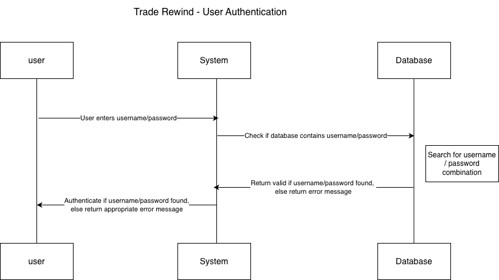
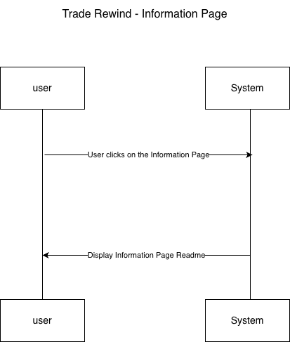

**Component Specification**

Please note that within each component we include a high level description of what it does.

**Component 1:** Authenticate

**Name:** Authenticate

**What it does:**  Verifies that a user exists in the system and that the password supplied matches the stored credentials.

**Inputs (with type information):**

* username (string): the user’s account identifier  
* password (string): the user’s account password  
  **Outputs (with type information):**  
* Boolean: True if authentication succeeds, False if it fails  
  **Assumptions:**  
* We can create the accounts using mongodb   
* User accounts already exist in the database  
* Passwords are stored securely    
  **How it uses other components:**  
* Queries the Database Component to retrieve stored user credentials

**Component 2:** StrategyAnalysis

**Name:** StrategyAnalysis

**What it does:**  
Simulates strategy performance based on trading signals and displays metrics associated with each strategy.

**Inputs (with type information):**

* Selected ticker (string)  
* Historical data for the ticker (floats)  
* Strategy parameters (string)  
* Time period (dates)  
* Alternative \- Input a table with strategies (csv file)  
  **Outputs (with type information):**  
* Simulated graph for the performance of strategy for the selected time period  
* Have a tool tip that allows you to see details for each data point in the graph  
* Table for the metrics related to the strategy   
  **Assumptions:**  
* That we have the historical data   
  **How it uses other components:**  
* Uses the specific metric component that is chosen by the user  
* Details are described in the information page

**Component 3:** Metrics

**Name:** Metrics computation

**What it does:**  
This is a feature for each metric that will be computed

**Inputs (with type information):**

* The stock/ticker (string)  
* The stock data (like prices) (float)  
*  The trading strategy  (string)  
* Time period (date)  
* Metric type to help identify what formula to use (string)  
  **Outputs (with type information):**  
* Computed Metrics value (float)  
  **Assumptions:**  
* The user understands what the metric they are choosing is and how it is calculated.  
* The data chosen is able to calculate that metric.   
  **How it uses other components:**  
* If a user doesn’t know what metrics to choose, they go to the information page to learn.

**Component 4:** Information  
	**Name:** Information Page

	**What it does**:  
Gives detailed information to the user. Describes the metrics (both definition and  
calculation formula). Explains the different trading strategies. Lists the different stock  
options to analyze. 

**Inputs:**

* Must click to enter this page

	**Outputs:**

* A Readme page

	**Assumptions:**

* Users have little knowledge of how stocks, trading, and metrics are calculated.

	**How it uses other components:**

* Gives explanations and definitions for choosing different metrics, stocks and trading strategies to help the user when using the strategy/analysis component.

